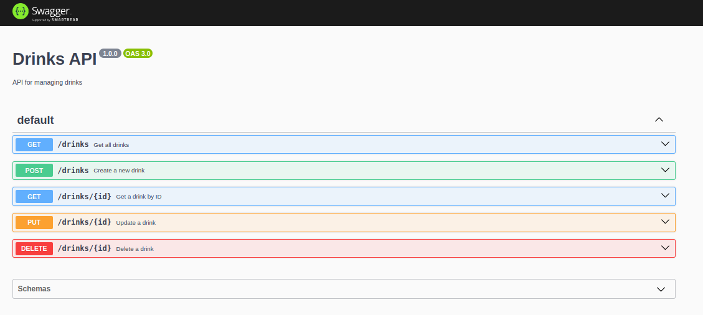
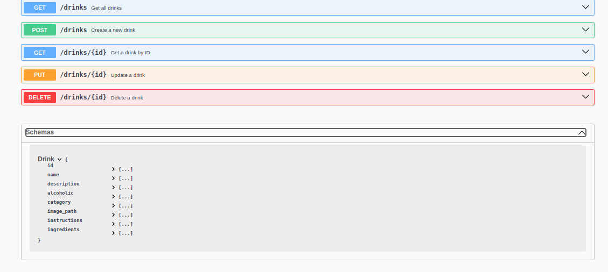

# drinksDB-API

This is a backend API for a drinks recipe application. It provides endpoints for managing recipes and ingredients, and it uses a PostgreSQL database for data storage.
## Requirements
    Node.js (v18 or above)
    PostgreSQL database

## Installation

Clone the repository:https://github.com/solonkonora/drinksDB-API.git

cd drinksDB-API

## Install the dependencies:

npm install

## Setting up the PostgreSQL database:

Create a new PostgreSQL database:

    Open your PostgreSQL client (e.g., pgAdmin, psql, or any other tool of your choice).
    Create a new database for your application. You can use a command like CREATE DATABASE your_database_name;.

Update the database connection credentials:

    In the root of your project, locate the env.example file.
    Open the env.example file and update the following environment variables with the appropriate values for your PostgreSQL database:

    DB_HOST=your_database_host
    DB_PORT=your_database_port
    DB_NAME=your_database_name
    DB_USER=your_database_username
    DB_PASSWORD=your_database_password

    Save the changes to the env.example file.

Rename the env.example file:

    Rename the env.example file to .env. This file will be used to store your environment variables and should not be committed to your version control system.

Install the required dependencies:

    If you haven't already, install the necessary dependencies for your Express.js application, including the PostgreSQL client library (e.g. pg ).

Configure the database connection:

    In your application's main file (app.js ), import the necessary modules and set up the database connection using the environment variables from the .env file.
    Ensure that your application can successfully connect to the PostgreSQL database.

Start the server:

    Terminal: npm run dev

The API server will start running on http://localhost:3000.

## API Documentation

The API documentation is available at /api-docs endpoint. It provides detailed information about the available endpoints, request/response structures, and example usage.
Endpoints
Drinks

    /drinks (GET): Retrieve all drinks.
    /drinks/<drink_id> (GET): Retrieve a specific drink by ID.
    /drinks (POST): Create a new drink.
    /drinks/<drink_id> (PUT): Update a drink by ID.
    /drinks/<drink_id> (DELETE): Delete a drink by ID.

## Screenshots

Here are some screenshots showcasing the documentation of the Food Recipe API:

## Contributing 
Contributions are welcome! If you find any issues or have suggestions for improvements, please open an issue or submit a pull request

## Social Media Handles

Connect with me on social media for the more:
    GitHub: @solonkonora
    Twitter: @SolonkoNora
    whatsapp: +237-652-161-749

## License
This project is licensed under the MIT License.